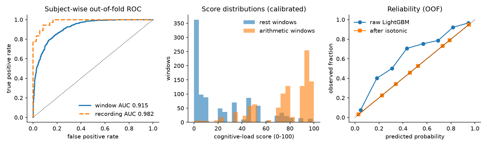
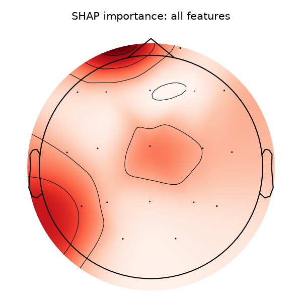
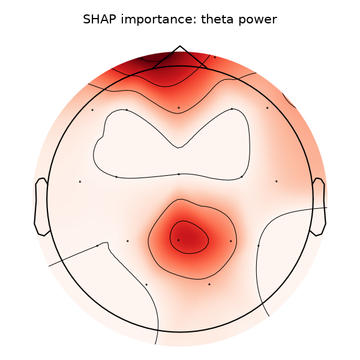
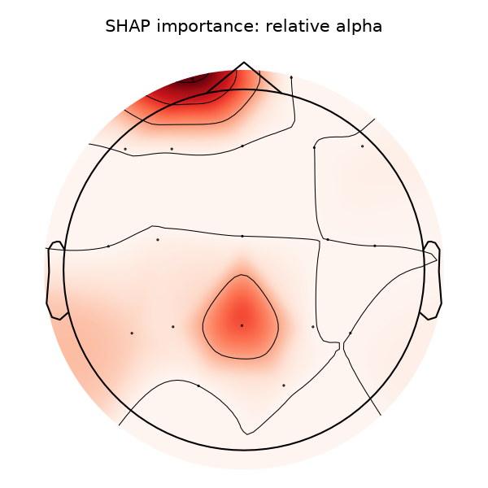

# eeg-cognitive-scoring

[](https://github.com/ankanbiswas022/eeg-cognitive-scoring/actions/workflows/ci.yml)


**From raw EEG to a calibrated, monitored cognitive-load score, served over an API.**

<p align="center"></p>

A production-style pipeline that turns multichannel EEG into a 0–100 cognitive-load /
stress-state score. Built on the public PhysioNet *EEG During Mental Arithmetic Tasks*
dataset (36 subjects, 19 channels, rest vs. serial-subtraction). The design decisions come
from eight years of EEG work (neurofeedback, >100-subject cohorts, source localisation) and
are documented in [docs/DESIGN.md](docs/DESIGN.md).

```
EDF ──> MNE preprocessing ──> 4-s windows ──> ~300 interpretable features ──> LightGBM ──┐
                                   │                                                     ├─> calibrated score
                                   └──> EEGNet / TCN / GRU (PyTorch, challenger) ────────┘   + confidence
                                                                                             + quality flags
   subject-wise CV · bootstrap CI · permutation test · SHAP · PSI drift · FastAPI · Docker    + drift status
```

## Results (subject-wise 6-fold CV, 36 subjects)

| model | OOF AUC [95 % CI] | balanced acc. | recording AUC | recording acc. |
|---|---|---|---|---|
| **LightGBM on baseline-relative features** (champion) | **0.915** [0.887, 0.941] | 0.83 | **0.982** | **0.917** |
| LightGBM on absolute features (ablation) | 0.745 [0.666, 0.816] | 0.70 | 0.781 | 0.750 |
| EEGNet on raw windows (challenger) | 0.858 [0.804, 0.906] | 0.77 | 0.913 | 0.833 |
| late fusion (mean of probabilities) | 0.929 | | | |

Recording-level label permutation test: null max 0.58, p = 1/21. Brier 0.135 → 0.115
after isotonic calibration. Whole run (features, three CV sweeps, 20 permutations, SHAP,
final fits): 11 min on a laptop CPU.

Numbers are out-of-fold over all 2045 scored windows; balanced and recording accuracies are
after calibration; CI is a subject-level cluster bootstrap. See
[artifacts/metrics.json](artifacts/metrics.json) and [reports/](reports/) for the full
breakdown, SHAP tables and scalp maps.

**The result that matters: score relative to the person's own baseline.** The first run
on absolute features reached AUC ~0.6 on 12 subjects, with SHAP pointing at absolute power
at Fp1, i.e. subject identity and eye artefact. Z-scoring every feature against a 60-s
eyes-closed calibration segment from the same person (disjoint from the scored windows)
is what lifts the model to 0.92, and the service enforces that contract: no baseline, no
score. Details and the ablation in [docs/DESIGN.md](docs/DESIGN.md#9-the-decision-that-mattered-most-score-relative-to-the-persons-own-baseline).

**A caveat, stated up front.** The top SHAP features are gamma and delta power at frontal
and temporal sites. In an effortful eyes-closed arithmetic task those bands are as likely
to carry jaw/forehead EMG and eye movement as cortical oscillations, so the score partly
reflects physiological effort. That is legitimate for a load/stress product but it is not
a pure cortical marker; mitigations are listed in [docs/MODEL_CARD.md](docs/MODEL_CARD.md).

<p align="center">
  
</p>

## Quick start

```bash
git clone https://github.com/ankanbiswas022/eeg-cognitive-scoring && cd eeg-cognitive-scoring
python -m venv .venv && . .venv/bin/activate          # Windows: .venv\Scripts\activate
pip install --index-url https://download.pytorch.org/whl/cpu torch && pip install -e ".[dev]"

pytest -q                                              # unit tests on synthetic EEG (no download)
bash scripts/download_data.sh                          # ~330 MB from PhysioNet
eegscore-train                                         # full run: features, CV, deep model, explainability
eegscore-train --skip-deep --n-perm 0                  # fast run (~1 min)

eegscore-serve                                         # FastAPI on :8000
python scripts/score_example.py data/raw/eegmat/Subject05_2.edf
```

Example response from `POST /score`:

```json
{
  "score": 95.7,
  "score_iqr": [89.5, 95.9],
  "n_windows": 30,
  "fraction_confident_windows": 1.0,
  "label": "high_load",
  "confidence": "high",
  "quality_flags": [],
  "window_scores": [97.8, 95.9, 97.8, 95.9, 95.7, 89.6, "..."],
  "windows_rejected": 0,
  "baseline_windows": 29,
  "drift": {"status": "ok", "top": [{"feature": "hjorth_complexity_T5", "mean_shift_z": 3.5}, "..."]},
  "model_version": "0.1.0",
  "latency_ms": 488.7
}
```

The request carries `data` (the recording to score) and either `baseline` (a separate
eyes-closed rest array) or `baseline_seconds` (use the first N seconds of `data` as
calibration). Without a baseline the service returns 422 rather than a misleading score.

## What is in the box

| Module | Purpose |
|---|---|
| `eegscore.data` / `preprocess` | EDF loading, notch/band-pass, average reference, resampling, window quality gates. One code path for training and serving. |
| `eegscore.features` | Multitaper band powers (abs/rel), load ratios (θ/α, β/α, engagement), frontal alpha asymmetry, aperiodic 1/f slope & offset, spectral entropy, Hjorth, alpha-band PLV. `BaselineStats` z-scores everything against the person's own calibration windows. |
| `eegscore.models.classical` | scikit-learn pipeline (impute → scale → LightGBM or logistic regression). Champion. |
| `eegscore.models.deep` | EEGNet, dilated TCN, BiGRU on raw windows with a scikit-learn-like wrapper. Challenger. |
| `eegscore.validation` | `GroupKFold` by subject, recording-level metrics, subject bootstrap CI, recording-level permutation test. |
| `eegscore.explain` | Family-level permutation importance, TreeSHAP, channel topomaps, deep saliency by band. |
| `eegscore.scoring` | Isotonic calibration on out-of-fold probabilities → 0–100 score, IQR, confidence, label. |
| `eegscore.monitoring` | Signal-quality flags (flat, saturated, mains, channel count) and PSI feature drift vs. training reference. |
| `eegscore.serve.app` | FastAPI: `/health`, `/model`, `/score` (JSON array), `/score/edf` (file upload). |
| `tests/` | 18 tests on synthetic EEG: feature sanity, leakage guard, baseline normalisation, model round-trip, calibration, drift, API. |

## Design choices worth arguing about

* **Subject-wise validation only.** Random window splits leak subject identity and inflate
  AUC by 0.1–0.3. Every number here is out-of-fold across subjects.
* **Feature model as champion, deep model as challenger.** With 36 subjects the
  interpretable model is at least as good and far easier to defend to a neuroscientist or a
  regulator; the deep model is wired into the same harness for when the cohort grows.
* **Scores, not probabilities.** Isotonic calibration fitted on out-of-fold predictions,
  recording-level median + IQR, an explicit confidence field, and quality flags that travel
  with the number.
* **Monitoring is part of the model.** Feature reference histograms are an artifact; every
  response carries a PSI drift status.
* **Eyes-closed in both conditions.** The dataset was chosen because rest and task are both
  eyes-closed, so the classifier cannot cheat on eye state via alpha.

## Data

Zyma I., Tukaev S., Seleznov I., Kiyono K., Popov A., Chernykh M., Shpenkov O.
*Electroencephalograms during Mental Arithmetic Task Performance.* Data 2019, 4(1):14.
PhysioNet: https://physionet.org/content/eegmat/1.0.0/ (ODC-BY 1.0).

## Author

Ankan Biswas — PhD (Neuroscience), IISc Bengaluru. EEG / LFP / closed-loop neurofeedback;
papers in *Imaging Neuroscience*, *EJN*, *eNeuro*. ankanbiswas0804@gmail.com · [Google Scholar](https://scholar.google.com/citations?user=oG28KRIAAAAJ) · [LinkedIn](https://www.linkedin.com/in/ankan-biswas-45357685/)
